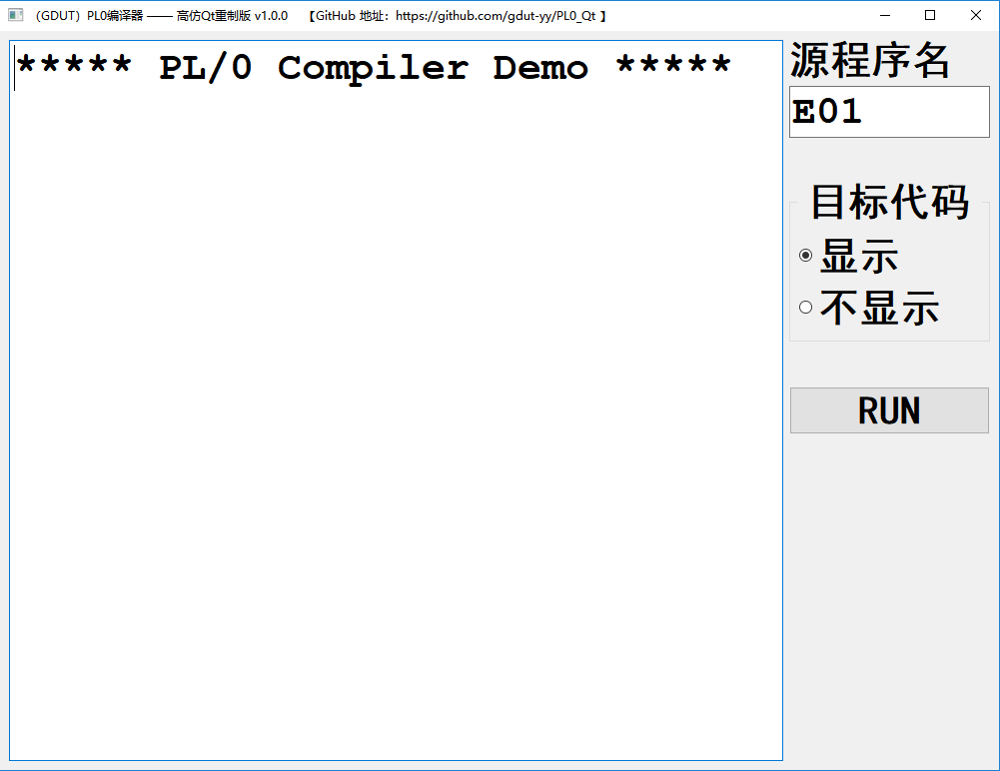
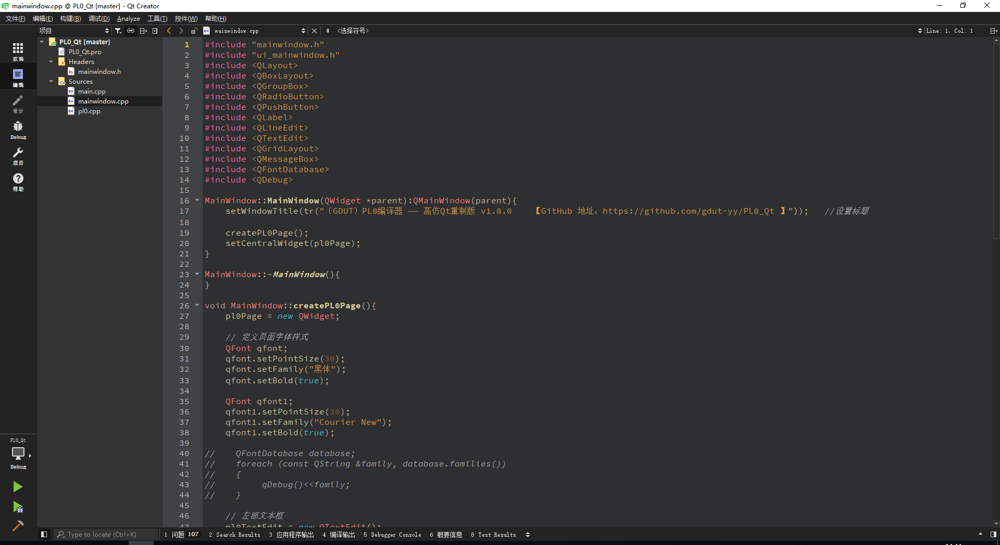
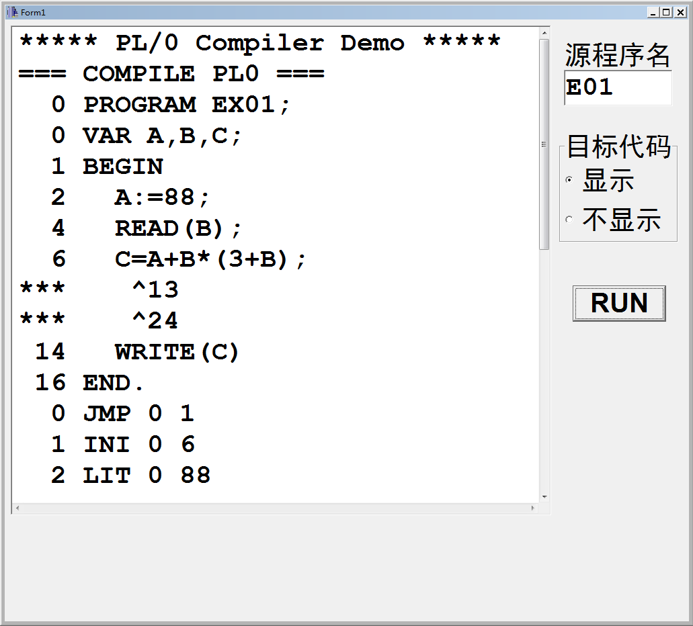
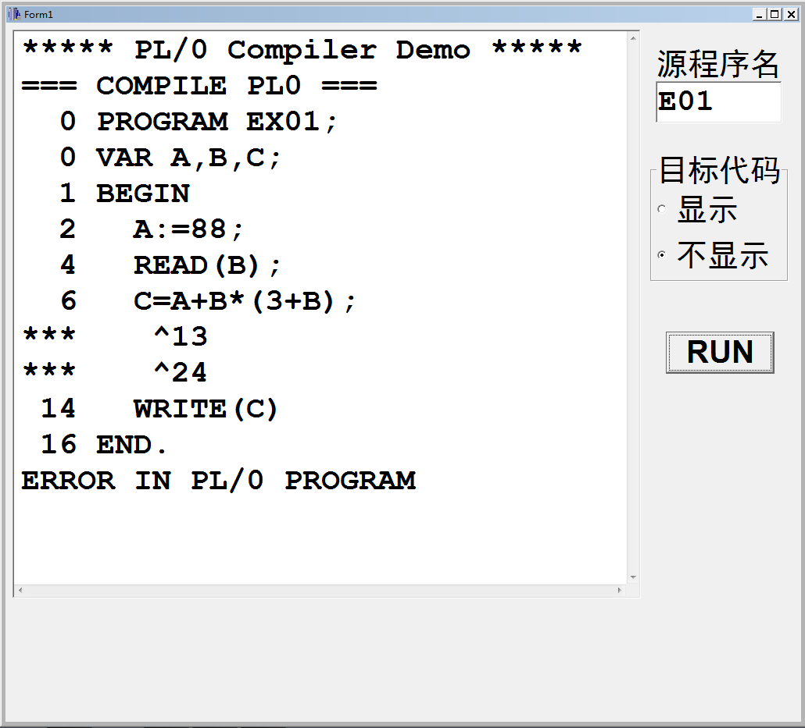
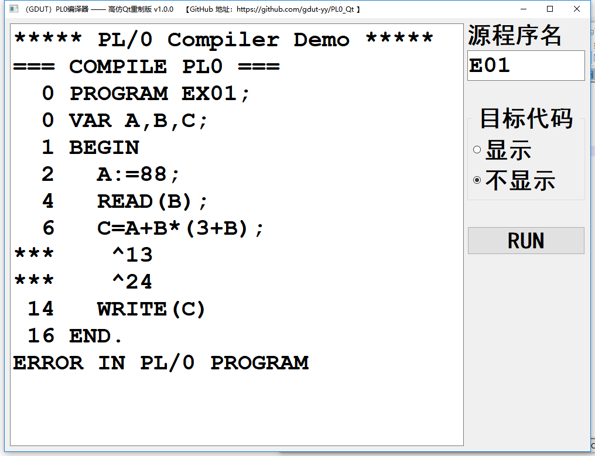
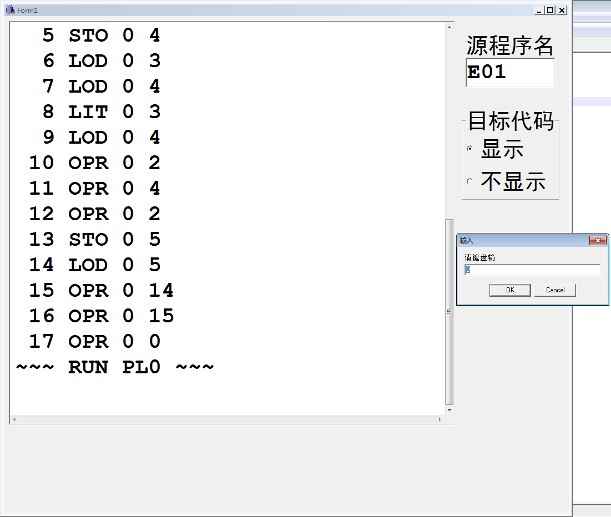
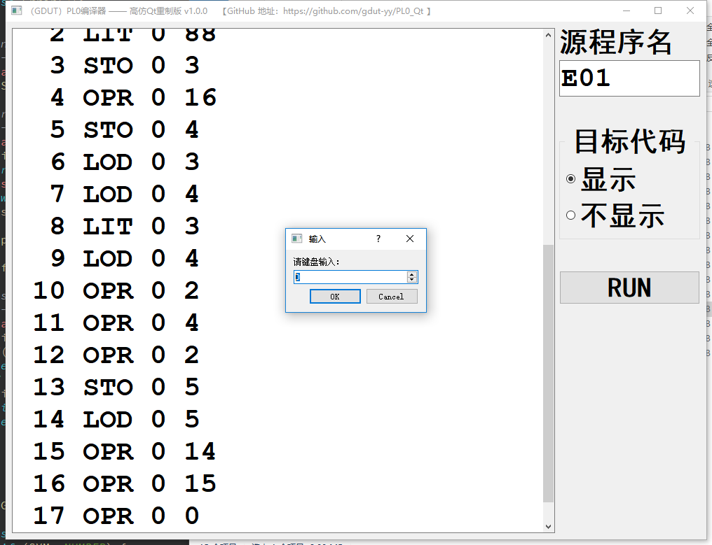
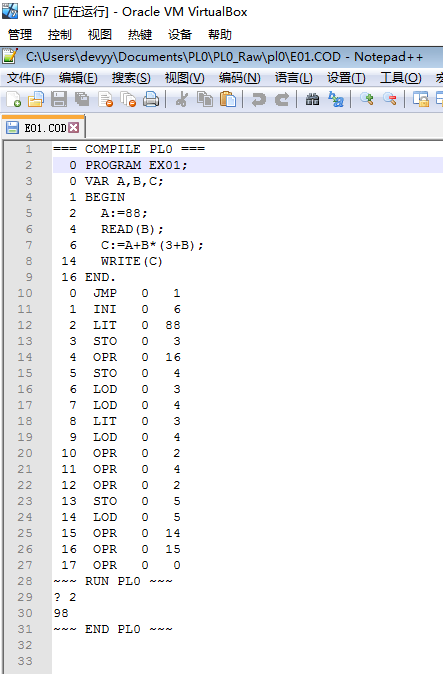
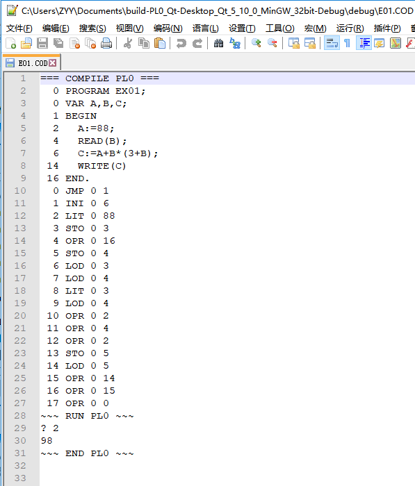

# PL/0 编译器 高仿Qt重制版 v1.0.0

## 一、项目来源

本项目源于 本人大三下学期 编译原理课程 的课内实验和课程设计。课程用书是 清华大学出版社的《编译原理（第3版）》。

尽管当下已是8102年，微软刚刚完成对GitHub的收购，但这门课的 实验和课设 还依旧沿用着“祖传代码”，虽然比起教材后面的源码要好一点（真的只是一点，多了个GUI界面），但Borland C++Builder 6 这个编译器实在是太旧了，作为曾经 T1级别的编译器，在现在这个智能编译器满天飞的时代高下立见，附图为Borland C++Builder 6界面。在Windows 10 版本更新到 1803的今天，由于Borland C++Builder 6的兼容性问题，本人只能专门安装一个 Windows 7的虚拟机 去完成这个 实验和课设。

此刻本人已基本完成 实验和课设。由于在 Windows 7 的虚拟机的 Borland C++Builder 6 编译器上修改代码十分恶心！！！

所以特地花了一个下午用Qt写了这个 高仿重制版。除了重写了 GUI 和修复了几个小 BUG 以外，尽最大力度保持了与源码的一致。

## 二、与 Borland C++Builder 6 对比（以 E01.PL0 为例）

### 1、E01.PL0 原文件（显示目标代码）：

	PROGRAM EX01;
	VAR A,B,C;
	BEGIN
	  A:=88;
	  READ(B);
	  C=A+B*(3+B);
	  WRITE(C)
	END.

原版输出：

Qt版本输出：

-----

### 2、E01.PL0 原文件（不显示目标代码）：

原版输出：

Qt版本输出：

-----

### 3、E01.PL0 原文件修正错误后：

	PROGRAM EX01;
	VAR A,B,C;
	BEGIN
	  A:=88;
	  READ(B);
	  C:=A+B*(3+B);
	  WRITE(C)
	END.

原版输出：

Qt版本输出：

-----

### 4、输入数值2后，COD文件结果：

原版输出：

Qt版本输出：

