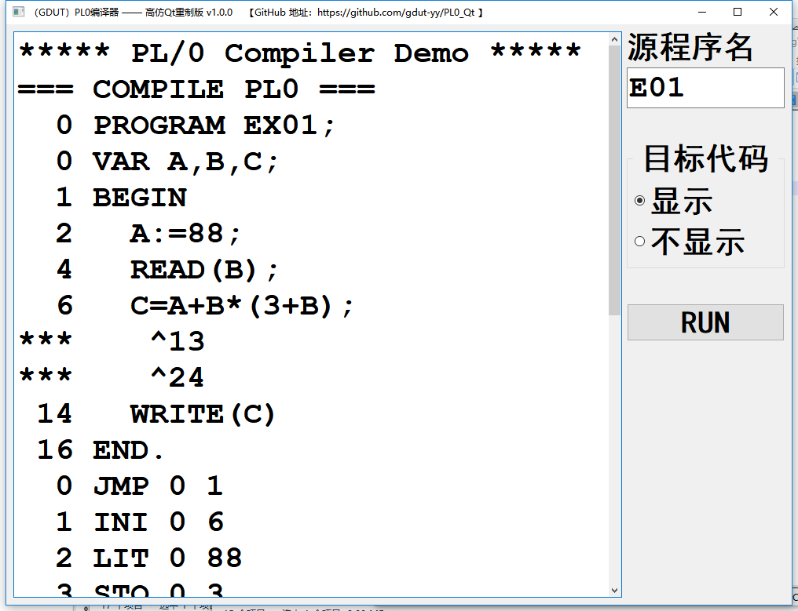

# PL/0 编译器 高仿Qt重制版（已更新至 v1.0.2）

## 一、相关 LINK

| 目录 | 说明 |
| - | - |
| [PL0_Raw](https://github.com/gdut-yy/PL0/tree/master/PL0_Raw) | 老师所提供的PL0项目（原始代码，实验和课设需在此基础上进行功能扩充） |
| [**PL0_Exp**](https://github.com/gdut-yy/PL0/tree/master/PL0_Exp) | **本人的实验报告项目** |
| [**PL0_Des**](https://github.com/gdut-yy/PL0/tree/master/PL0_Des) | **本人的课程设计项目** |
| [PL0_Cpp](https://github.com/gdut-yy/PL0_Cpp) | 教材附录A中的 PL/0代码（C版本）。（所用编译器是 VS2017） |
| [PL0_Java](https://github.com/gdut-yy/PL0/tree/master/PL0_Java) | PL0_Cpp 改写而成的 PL/0代码（Java版本）。（所用编译器是 eclipse） |
| [**PL0_Qt**](https://github.com/gdut-yy/PL0_Qt) | **本人的 Qt 高仿重制版** |

## 二、实现功能
	
	1. 增加了保留字 ELSE，FOR，STEP，UNTIL，RETURN； 运算符 *=，/=，&，||，！ ；
	2. 不等号 由 # 改为了 <> ；
	3. 增加了条件语句的ELSE子句 ；
	4. 扩充赋值运算：*= 和 /= ；
	5. 扩充语句。FOR <变量>:=<表达式>STEP<表达式>UNTIL<表达式>Do<语句> ；
	6. （选做）扩充运算符 +=，-= ；
	7. （选做）扩充运算：++ 和 -- ；
	8. （选做）多行注释功能 /**/ 实现 ；
	9. （选做）单行注释功能 // 实现 ；

----

## 三、项目来源

本项目源于 本人大三下学期 编译原理课程 的课内实验和课程设计。课程用书是 清华大学出版社的《编译原理（第3版）》。

尽管当下已是8102年，微软刚刚完成对GitHub的收购，但这门课的 实验和课设 还依旧沿用着“祖传代码”，虽然比起教材后面的源码要好一点（真的只是一点，多了个GUI界面），但Borland C++Builder 6 这个编译器实在是太旧了，作为曾经 T1级别的编译器，在现在这个智能编译器满天飞的时代高下立见，附图为Borland C++Builder 6界面。在Windows 10 版本更新到 1803的今天，由于Borland C++Builder 6的兼容性问题，本人只能专门安装一个 Windows 7的虚拟机 去完成这个 实验和课设。

此刻本人已基本完成 实验和课设。由于在 Windows 7 的虚拟机的 Borland C++Builder 6 编译器上修改代码十分恶心！！！

所以特地花了一个下午用Qt写了这个 高仿重制版。除了重写了 GUI 和修复了几个小 BUG 以外，尽最大力度保持了与源码的一致。

## 四、与 Borland C++Builder 6 对比（以 E01.PL0 为例）

### 1、E01.PL0 原文件（显示目标代码）：

	PROGRAM EX01;
	VAR A,B,C;
	BEGIN
	  A:=88;
	  READ(B);
	  C=A+B*(3+B);
	  WRITE(C)
	END.

原版输出：

Qt版本输出：

-----

### 2、E01.PL0 原文件（不显示目标代码）：

原版输出：

Qt版本输出：

-----

### 3、E01.PL0 原文件修正错误后：

	PROGRAM EX01;
	VAR A,B,C;
	BEGIN
	  A:=88;
	  READ(B);
	  C:=A+B*(3+B);
	  WRITE(C)
	END.

原版输出：

Qt版本输出：

-----

### 4、输入数值2后，COD文件结果：

原版输出：

Qt版本输出：

